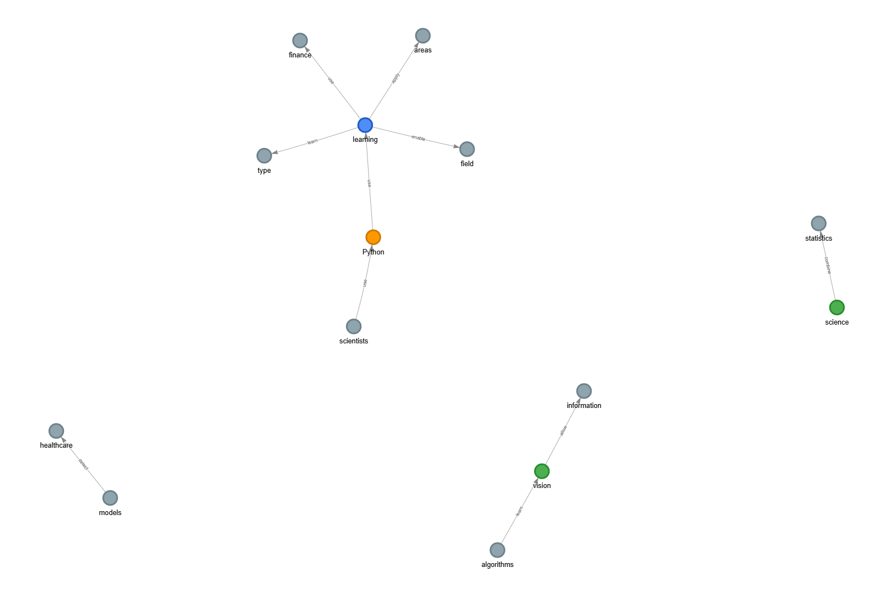
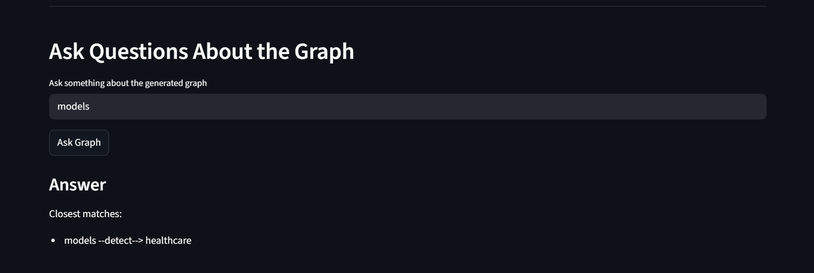
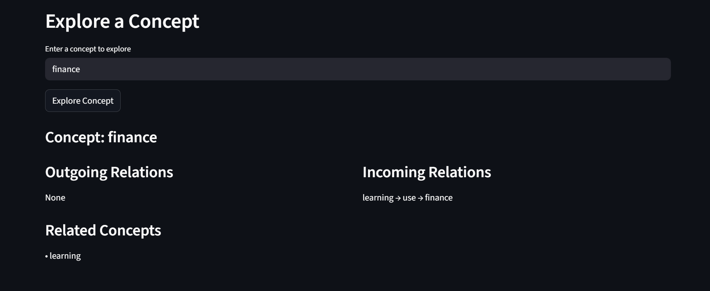

NeuroVault :

NeuroVault is an AI-powered tool that extracts concepts and relationships from text and builds an interactive knowledge graph.

Features :

- Extract concepts using NLP
- Identify relationships between concepts
- Generate interactive knowledge graphs
- Ask questions about the graph
- Explore concept connections

Tech Stack :

- Python
- Streamlit
- SpaCy
- NetworkX
- PyVis

Installation :

Clone the repository:

```
git clone https://github.com/YOURUSERNAME/NeuroVault.git
cd NeuroVault
```

Create environment:

```
python -m venv venv
venv\Scripts\activate
```

Install dependencies:

```
pip install -r requirements.txt
python -m spacy download en_core_web_sm
```

Run the application:

```
streamlit run app.py
```

Screenshots : 

Knowledge Graph :



Concept Explorer :



Graph Question Answering :



Example Input

```
Python is used for machine learning.
Machine learning is applied in computer vision.
Neural networks are used in machine learning.
```
Future Improvements

- AI knowledge summaries
- Graph embeddings
- Multi-document graphs
- Neo4j integration