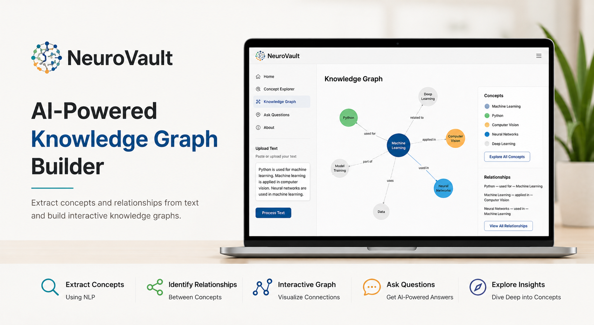
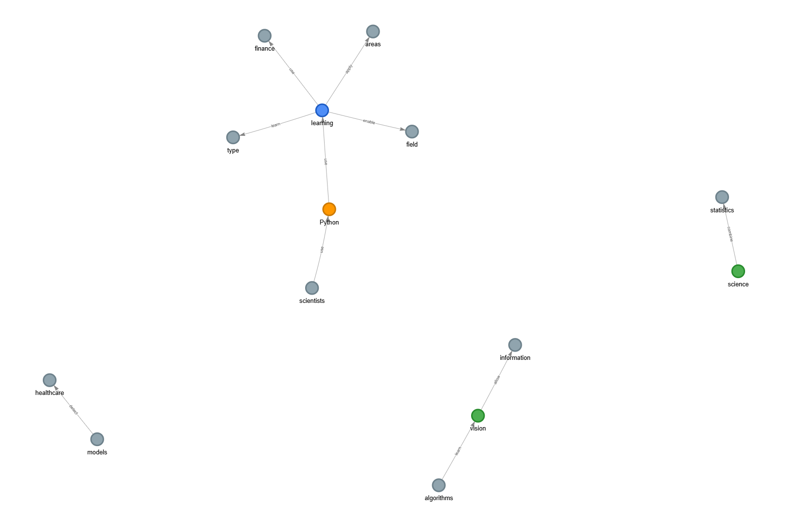
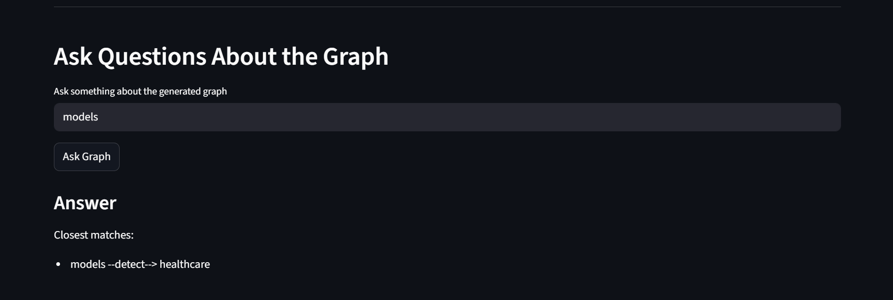
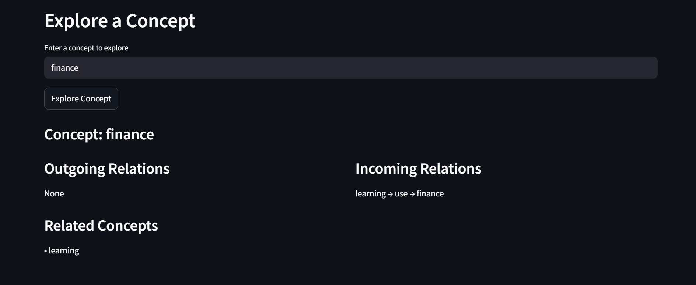

# 🧠 NeuroVault

<p align="center">
  
</p>

<p align="center">


</p>

An AI-powered knowledge graph platform that extracts concepts and relationships from unstructured text using Natural Language Processing (NLP) and visualizes them as interactive knowledge graphs for exploration and analysis.

---

# Overview

NeuroVault transforms plain text into an interactive knowledge graph by identifying entities and semantic relationships using NLP techniques.

Instead of reading long documents line by line, users can visualize concepts, explore their connections, and query the generated graph to better understand complex information.

---

# Problem

Large documents, research papers, and study materials often contain interconnected ideas that are difficult to understand through plain text alone.

Finding relationships between concepts manually is time-consuming and limits knowledge exploration.

---

# Solution

NeuroVault automatically extracts concepts from text, detects relationships between them, and builds an interactive knowledge graph that users can navigate visually.

This enables faster learning, document understanding, and semantic exploration.

---

# Features

- 📄 Upload or paste text documents
- 🧠 NLP-based concept extraction using SpaCy
- 🔗 Automatic relationship detection
- 🌐 Interactive knowledge graph visualization
- 🔍 Concept explorer
- 💬 Ask questions about the generated graph
- 📊 Interactive graph navigation using PyVis

---

# Tech Stack

| Layer | Technology |
|--------|------------|
| Language | Python |
| Framework | Streamlit |
| NLP | SpaCy |
| Graph Processing | NetworkX |
| Graph Visualization | PyVis |

---

# Screenshots

## Knowledge Graph



---

## Concept Explorer



---

## Graph Question Answering



---

# Architecture

```text
Input Text
      │
      ▼
Text Processing
      │
      ▼
SpaCy NLP
(Entity Extraction)
      │
      ▼
Relationship Detection
      │
      ▼
NetworkX Graph
      │
      ▼
PyVis Interactive Visualization
      │
      ▼
Concept Explorer & Q/A
```

---

# Installation

Clone the repository

```bash
git clone https://github.com/PoojaSiv0211/NeuroVault.git
cd NeuroVault
```

Create a virtual environment

```bash
python -m venv venv
```

Activate the environment

Windows

```bash
venv\Scripts\activate
```

Linux / macOS

```bash
source venv/bin/activate
```

Install dependencies

```bash
pip install -r requirements.txt
python -m spacy download en_core_web_sm
```

Run the application

```bash
streamlit run app.py
```

---

# Example Input

```text
Python is used for machine learning.

Machine learning is applied in computer vision.

Neural networks are used in machine learning.
```

---

# Example Output

The generated graph identifies:

- Python → used for → Machine Learning
- Machine Learning → applied in → Computer Vision
- Neural Networks → used in → Machine Learning

The relationships are displayed as an interactive knowledge graph that users can explore visually.

---

# Use Cases

- Knowledge graph generation
- Educational concept mapping
- Research paper exploration
- NLP demonstrations
- Semantic relationship discovery
- AI and Data Science learning
- Information visualization

---

# Future Improvements

- Gemini-powered knowledge summaries
- Multi-document knowledge graphs
- Neo4j database integration
- Graph embeddings
- Semantic search
- Document comparison
- PDF upload support
- Export graph as HTML/PDF

---

# Project Structure

```text
NeuroVault/
│
├── screenshots/
├── utils/
├── app.py
├── requirements.txt
├── README.md
└── .gitignore
```

---

# Author

**Pooja Sivaramalingam**

AI & Data Science Undergraduate

---

⭐ If you found this project interesting, consider giving it a star!
